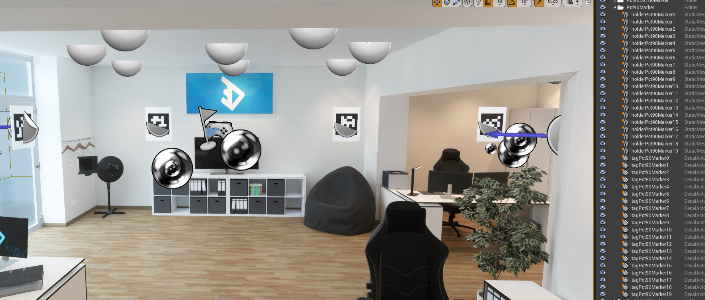
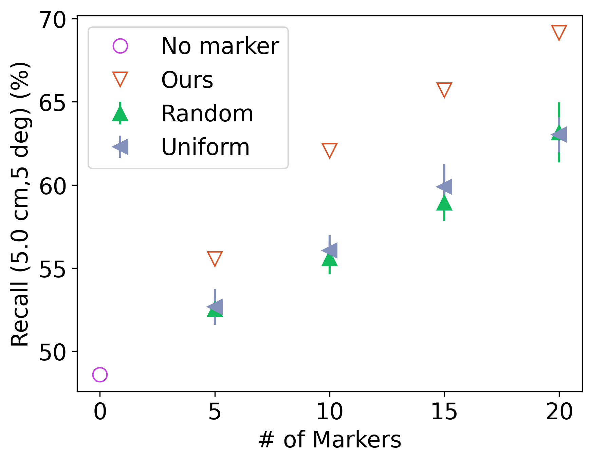

# OMP: Optimized Marker Placement
This is the code base for the paper [Optimizing Fiducial Marker Placement for Improved Visual Localization](https://arxiv.org/abs/2211.01513).

```bibtex
@article{huang2023omp,
  title={Optimizing Fiducial Marker Placement for Improved Visual Localization},
  author={Huang, Qiangqiang and DeGol, Joseph and Fragoso, Victor and Sinha, Sudipta N. and Leonard, John J.},
  journal={IEEE Robotics and Automation Letters},
  year={2023}
}
```

This work explores the problem of automatic marker placement within a scene. Specifically, given a predetermined set of markers and a scene model, we compute optimized marker positions within the scene that can improve accuracy in visual localization.

The code and examples shown below have been tested on Ubuntu 20.04. It is a long README. You may want to navigate using tables of contents below and/or beside README.md in the header. Here is a teaser video about our work:

https://user-images.githubusercontent.com/5796120/224241331-9ab8705b-3676-4709-9e3e-f26a33c1486a.mov


Table of Contents
=================
* [OMP: Optimized Marker Placement](#omp-optimized-marker-placement)
* [Installation](#installation)
   * [The OMP code](#the-omp-code)
   * [AirSim and the Unreal Engine](#airsim-and-the-unreal-engine)
* [Starting from scratch with a textured 3D model](#starting-from-scratch-with-a-textured-3d-model)
   * [Step 1: creating an environment in Unreal Engine](#step-1-creating-an-environment-in-unreal-engine)
   * [Step 2: creating an occupancy grid map of the environment](#step-2-creating-an-occupancy-grid-map-of-the-environment)
   * [Step 3: generating the data needed by the OMP algorithm](#step-3-generating-the-data-needed-by-the-omp-algorithm)
   * [Step 4: computing the optimized marker placement](#step-4-computing-the-optimized-marker-placement)
   * [Step 5: computing random and uniform placements](#step-5-computing-random-and-uniform-placements)
   * [Step 6: placing markers](#step-6-placing-markers)
   * [Step 7: generating the data for evaluating marker placements](#step-7-generating-the-data-for-evaluating-marker-placements)
   * [Step 8: evaluation by computing the localization recall](#step-8-evaluation-by-computing-the-localization-recall)
# Installation
## The OMP code
The OMP code includes not only the implementation of the algorithm, Optimized Marker Placement (OMP), described in our paper but also other marker placement methods as well as scripts for simulating the data needed by OMP and evaluating marker placement methods.
```
git clone git@github.com:doublestrong/OMP.git
cd OMP
conda env create -f env.yaml
conda activate omp
```

## AirSim and the Unreal Engine
We use [Unreal Engine 4.27](https://www.unrealengine.com/en-US) and [AirSim](https://github.com/microsoft/AirSim) to create a simulation environment and collect data from the environment, respectively. To create an environment for a real-world scene, a textured mesh of the scene (e.g., ply, obj, fbx files) is needed. We assume you already have the mesh in hand, so we do not include packages for 3D reconstruction here.

Please refer to [AirSim](https://github.com/microsoft/AirSim) for installing Unreal Engine 4.27 and AirSim. On Ubuntu, you can test the installation by using `UnrealEngine/Engine/Binaries/Linux/UE4Editor` to open `AirSim/Unreal/Environments/Blocks/Blocks.uproject`. If you encounter errors in opening `Blocks.uproject`, please refer to [this post](https://github.com/microsoft/AirSim/issues/4535). To install the Python API of AirSim, please refer to [this issue](https://github.com/microsoft/AirSim/issues/3333) for installing the API with an improved speed for generating images. We adapt suggestions in that github issue for our use:
```console
cd ..
git clone -b fix-msgpack-dep git@github.com:tbelhalfaoui/msgpack-rpc-python.git
pip install tornado==4.5.3
cd msgpack-rpc-python
python setup.py install
cd ../AirSim/PythonClient/airsim
```
Apply the following modification to the file `client.py` in `AirSim/PythonClient/airsim`:
```python
class VehicleClient:
    def __init__(self, ip = "", port = 41451, timeout_value = 3600):
        if (ip == ""):
            ip = "127.0.0.1"
        # self.client = msgpackrpc.Client(msgpackrpc.Address(ip, port), timeout = timeout_value, pack_encoding = 'utf-8', unpack_encoding = 'utf-8')
        self.client = msgpackrpc.Client(msgpackrpc.Address(ip, port), timeout = timeout_value)
```
and then go back to the directory `AirSim/PythonClient` and install the Python API of AirSim from the modified source code:
```console
cd ..
python setup.py install
```
Now you should have finished the installation so go back to the OMP folder:
```console
cd ../../OMP
```


# Starting from scratch with a textured 3D model
In our paper, we used two of the 3D models in the [HM3D](https://aihabitat.org/datasets/hm3d/) dataset, the [ThreeDee Office](https://www.unrealengine.com/marketplace/en-US/product/threedee-office) scene from the Unreal Engine marketplace, and a [3D reconstruction](https://drive.google.com/file/d/1iVoYfnrW1ZcT6gmXkw05an3AiJh0z08q/view?usp=share_link) we built for a MoCap room. The OMP settings we used for these models can be found in the `configs` folder. We use the ThreeDee Office for the instructions below. If you would like to try the HM3D or the MoCap models, overwrite the file `omp_settings.yaml` by corresponding yaml files in the `configs` folder.

## Step 1: creating an environment in Unreal Engine
Copy and paste the folder `AirSim/Unreal/Environments/Blocks` for re-using the Blocks project, which has been complied on your computer since you installed AirSim. Open your copy in `UE4Editor` and import your 3D model. You may need to add lights in `UE4Editor` if the simulation scene looks dark. Now do the following steps to make the scene work with our OMP code:
1. Lift the actor `PlayerStart` in `UE4Editor` to the height you would like to place markers (e.g., the eye level of a human user in our paper). Our code will discretize the plane at the same height later.
2. We need to manually select some observation points in the plane (i.e., x and y) for creating an occupancy grid map later. Place a few UE actors of `Cube` such that scanning in place at coordinates of these cubes can cover the entire plane. Lift these cubes outside the scene by setting their z coordinates to something like 999999. Our code will look for actors named as Cube, Cube2, Cube3, etc., read their x and y coordinates, and scan the scene from these coordinates on the plane to create the occupancy grid map.

Here is what we see in `UE4Editor`:


## Step 2: creating an occupancy grid map of the environment
Just like creating the map in realworld, you need to config a robot (or camera), collect data, and build the map:
1. Rename the file `~/Documents/AirSim/settings.json` to save a copy of the default setting created by AirSim. Copy `setting.json` in our repo to `~/Documents/AirSim` to use our setting, where we specify camera intrinsics and set `SimMode` to `ComputerVision` and `ViewMode` to `NoDisplay`.
2. Specify `data_dir` in `omp_settings.yaml` in our repo to a project directory on your computer for saving all the data for your project. Hit `Play` in `UE4Editor` and run the following script in terminal under the `omp` environment
   ```console
   python scripts/airsim_capture_coarse.py
   ```
   Now you should be able to see a new folder `coarse_scan_images` and some new files such as `cube_points.txt` in your project directory.
3. To create the occupancy grid map using the data you just generated, run
   ```console
   python scripts/occupancy_grid_get_free_dots.py
   ```
   Now you can find a figure `grid.png` in your project folder:

   

      The dots in the figure indicate feasible camera locations, whose (x,y) coordinates are saved in the file `free_dot.txt`.

## Step 3: generating the data needed by the OMP algorithm
The data refers to images (RGB, depth, and surface normals) at feasible camera poses. To generate the data, hit `Play` in `UE4Editor` and run
```console
python scripts/airsim_capture_free_dots.py
```
You can find the data in a new folder `free_dots_scan_images` under your project directory.

## Step 4: computing the optimized marker placement
Run
```console
python scripts/optimized_marker_placement.py
```
The script above generates a few files as follows and then starts computing the optimized placement, for which all intermediate results are saved in the folder `imp_res` in your project directory.
1. `free_dots_data.pkl`: a list. Each element in the list is an instance of dataclass `KpScanData` that stores the parsed data at a feasible camera location. The parsed data refers to a list of feasible camera poses, a list of key points, a list of scan points, a list of segmentation info at the scan points, a list of surface normals, and a list of descriptors at the key points.
2. `scan_point_map.txt`: points on the boundary of the free space, which are downsampled from scan points in the occupancy grid map.
3. `candidate_marker_poses.pkl` and `candidate_marker_poses.txt`: feasible marker poses.
4. `candidate_markers.png`: arrows indicate feasible marker poses.

     

You can find the optimized placement `current_placement.txt` in the folder `imp_res/90percent_markers/run0`. Images in the folder show the localizability scores and information gains with different trial marker placements. The newest figure in the folder visualizes the optimized marker placement as follows:


## Step 5: computing random and uniform placements
We used these two methods as baselines in our paper. To compute these placements,
```console
python scripts/random_placements.py
python scripts/unif_contour_placements.py
```
Now you can find 5 sets of random placements in the folder `rd_placements` and 5 sets of uniform placements in the folder `unif_contour` under your project directory.

## Step 6: placing markers
If you would like to evaluate marker placements in simulation environments, we provide you Python scripts that automatically place AprilTags in simulation environments. Please follow the three steps below:
1. Download png images of all tags in the family of AprilTag tag36h11: [link](https://drive.google.com/drive/u/0/folders/1ShIr_YNgE3fR5EUfe0tdIYYpp_1Ghl-U).
2. If you would like to place K tags, import the first K of these tag images to `UE4Editor`. Specifically, in Content Browser of `UE4Editor`, navigate to `/Game/Flying/`, create a folder `tags`, and import images with tag IDs from 0 to K-1 to the folder. Create materials for each of these imported images by right-clicking the image and choosing `Create Material`, generating a new material in the folder. We need to convert the material to a decal. Double-click the material and set `Material Domain` to `Deferred Decal`, `Blend Mode` to `Translucent`, and `Decal Blend Mode` to `Translucent`.

     
       
     

3. In your UE4Editor, open the console by clicking Windows->Developer Tools->Output Log. Set the console to the Python mode and put the path of the python script for UE in the console:
       
   
   You need to change `imp_res_file` in the script to specify the results file of OMP, i.e., `imp_res/90percent_markers/run0/current_placement.txt`. You may want to adjust `decal_scale` in the script to resize tags in the simulation environment. Scripts for the OMP, random placements, and uniform placements are
   ```
   scripts/unreal_omp_script.py
   scripts/unreal_rd_script.py
   scripts/unreal_uc_script.py
   ```
   
   What we see after using the script `unreal_omp_script.py` to place markers:
   
     
   
   After running all three scripts in the UE console, you can find AprilTags newly added to the scene in `UE4Editor`. It could happen that a part of a tag is inside walls after placing tags automatically. You may need to slightly adjust poses of some tags in the simulation environment to ensure reasonable quality of the marker placement. This is a known issue because we do not consider marker sizes in the OMP algorithm. After you check all markers, set z coordinates of all markers and correlated assets in `UE4Editor` to something like 99999 to lift them outside the scene. In following sections, we will use scripts to move a set of markers down each time when we generate the data for evaluating solely this set of markers.

## Step 7: generating the data for evaluating marker placements
Hit `Play` in `UE4Editor` and run
```console
python scripts/airsim_capture_train_test_increment.py
```
In your project directory, you can find a new folder `evaluation`, which contains all the data for evaluating marker placements. If you would like to evaluate random and uniform placements as well, add these cases to `rd_ids` and `uc_ids` in the file `omp_settings.yaml`, respectively. An example of test images is shown below:
     
   

## Step 8: evaluation by computing the localization recall
Run
```console
python scripts/evaluation_train_test.py
```
You can find results under the folder `evaluation`. For example, for the case `NoMarker`, you can find results in the folder `evaluation/NoMarker/pkl/result`.
To plot results,
```console
python scripts/plot_perf.py
```
You can find figures for all marker placements in `evaluation/figs/result`. An example is as follows:
     


